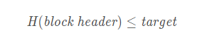

# 6.29

学习了markdown语言的语法知识以及如何使用typora。

## **B站区块链网课**

### **肖臻教授第一节 课程简介**

1. 不要被比特币限制了思维。

### **肖臻教授第二节 BTC密码学原理**

1. 比特币主要用到密码中的两个功能：哈希和签名。

2. collision resistance 哈希碰撞：x不等于y，H（x）=H（y）。MD5:已经可以人为的制造哈希碰撞了。

   hiding：x->H（x）,只能是单向的，可以从x推出H（x），无法从H（x）推得x，从这个性质可知，x作为需要加密的东西，可计算出一个可公布的哈希值，但是人们又无法从哈希值算出加密信息。（输入空间足够大，且均匀）

   puzzle friendly：这个性质是说哈希值的计算结果是不可预测的，也就是光是去看这个输入没法知道计算出来的哈希值可能是什么样的（具有什么特征）。比特币挖矿的过程就是去找一个随机数nonce，这个nonce和区块的块头里的其它信息合并在一起作为输入，取哈希值，所得哈希值要小于等于某个指定的阈值： 

   

   有了==puzzle friendly==这个性质，使得比特币挖矿的过程没有捷径可言，只能不停的去试大量的==nonce==才能找到符合要求的解，所以才能用来用作**工作量证明**（proof of work）。

   比特币中的哈希函数：SHA-256。

3. 比特币开户：创立一个公钥和私钥的对。加密用公钥，解密用私钥。

4. 比特币系统中，先对一个message取一个哈希，然后再对这个哈希值进行签名。

### **肖臻教授第三节 BTC数据结构**

1. 哈希指针（hash pointer） <u>通过前一个区块中信息计算出下一个区块中的哈希指针，因此区块链中任意一个部分被篡改都会导致之后的哈希指针对不上之前的区块,所以我想这应该是区块链不可篡改性质的原因。</u>
2. merkle tree：带有哈希指针的二叉树。

## **隐私计算，安全多方，零知识，同态，电子签名实例**

1. 蚂蚁链摩斯多方安全计算平台（区块链溯源服务，区块链积分销售，供应链金融服务平台）
2. 洞见科技：INSIGHTONE——洞见科技基于安全多方计算（同态加密、差分隐私、不经意传输、混淆电路、秘密共享等）、联邦学习和区块链技术独立自研的金融级隐私保护计算平台产品。

## C#

变量命名注意事项：

1. 不要出现关键字（应该就是在这里面有固定用法的词汇）。
2. 不要以数字开头。
3. 不建议使用中文。

项目命名规范：

1. 整个项目使用同一种命名规范。
2. 变量名：小写开头，小驼峰。    ex：inputStr
3. 函数名，类名：大写开头，大驼峰。   ex：Console.ReadLine（）；

