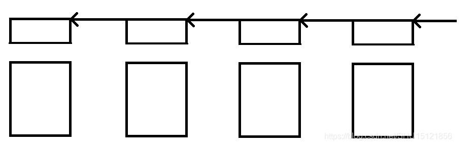
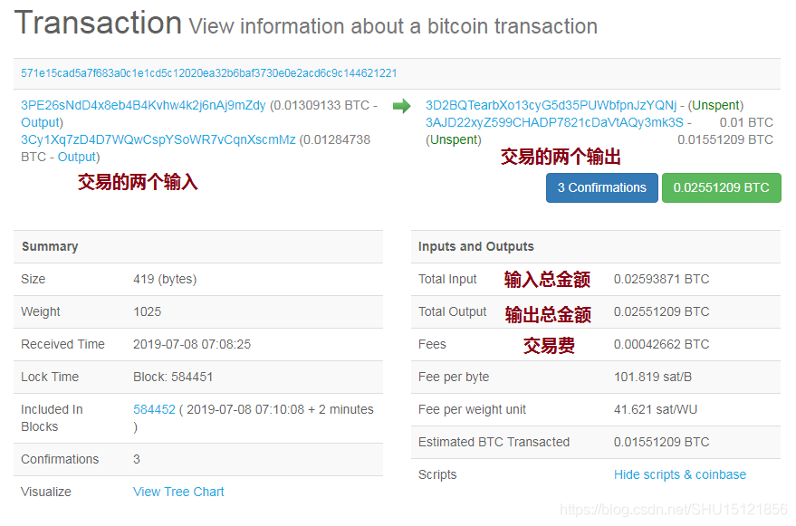
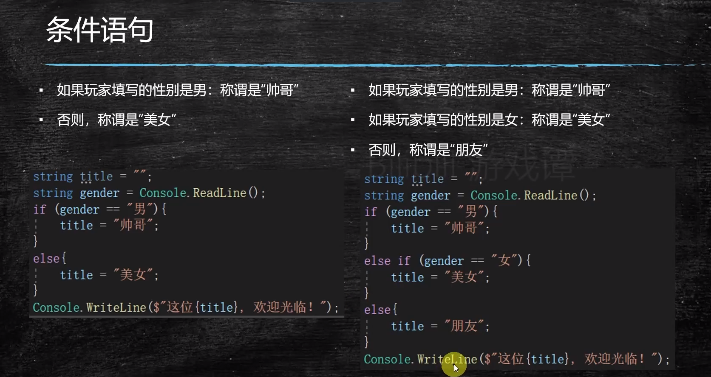
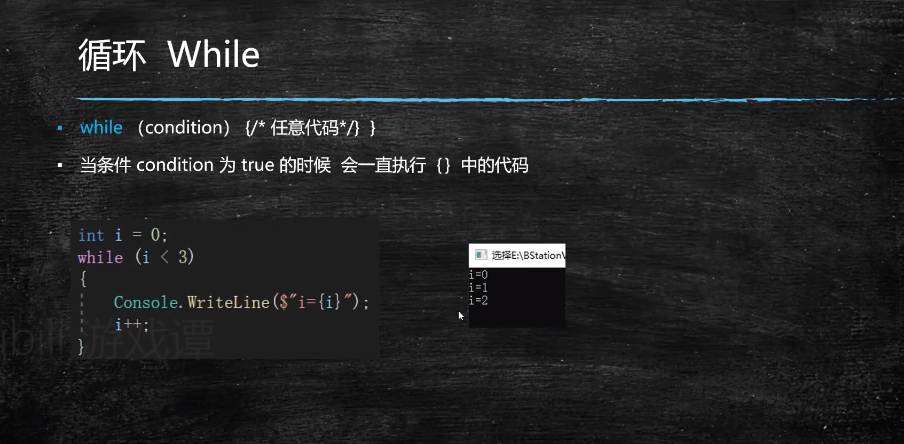
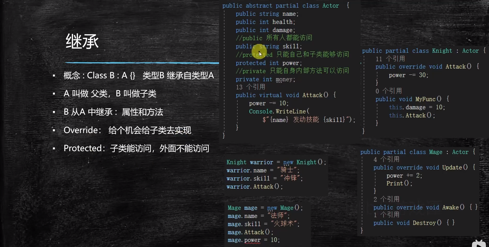
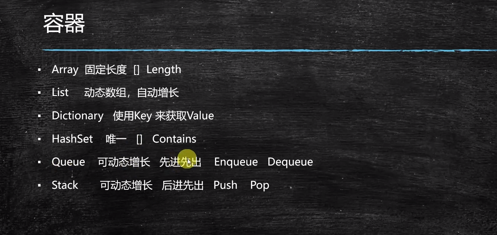

# 6.30

## **B站区块链网课**

### **肖臻教授第四节**  BTC**协议**

1. 非对称加密体系：是用**==接受者==**的公钥加密，收到后再用自己的私钥解密。

2. 每个区块可以看成是两部分，block header和block body.

   block header : version , hash of previous block header , merkle root hash , target（和挖矿有关），nonce（随机数）。

   block body : 交易列表transaction list。

   比特币系统中每个交易都分为输入部分和输出部分，**输入部分要给出这笔交易的比特币的来源以及付款方的公钥（代表了付款人的身份），输出部分要给出收款人的公钥的哈希值**。比特币系统中的收款地址就是收款人的公钥取哈希再经过一些转换得到的。

3. 区块结构：

   上图中连起来的是块头，块身挂在区块上，哈希指针和块身没有直接联系（间接联系就是通过Merkle Tree的根哈希建立的）。

   注意全结点（fully validation node）是有块身的，需要验证所有交易的合法性；轻结点（light node）是没有块身的，没有办法独立验证交易的合法性。
   轻结点没有参与区块链的构造和维护，只是利用了区块链中的部分信息。
   系统中大部分结点是轻结点，全结点不是很多。

4. 在普通的分布式系统中，如分布式哈希表里，取得的共识就是哈希表中的内容。比特币系统中，**共识协议取得的共识是去中心化的账本里的交易**。只有获得记账权的结点可以往区块里写交易，而获得记账权的途径就是解那个不等式puzzle，根据第一节课学习的哈希函数puzzle friendly的性质，求解这个puzzle的过程没有捷径，只能一个一个nonce去尝试，所以可以作为工作量的证明，算力越强得到出块奖励的概率也就越大，所以才说==比特====币系统中是靠算力来投票的。==

### **肖臻教授第五节  BTC实现**

区块链是去中心化的账本，比特币采用的是**基于交易的账本模式（transaction-based ledger）**，只记录了转账交易和铸币交易，并没有直接记录每个账户上有多少钱。如果想知道某个比特币账户上有多少钱，要通过交易记录来推算。

#### **一个转账交易的例子**

在这个转账交易中，左边是交易的两个输入（虽然旁边写的是Output，这是表示它们花掉的是之前哪个交易的Output）；右边是交易的两个输出（从绿色Unspent字样可以看到还没有花出去，所以会保存在UTXO里）。

### **肖臻教授第6节 BTC网络**

比特币网络的设计原则是简单、鲁棒，而不是高效。每个结点维护一个邻居结点的集合，消息在网络中采用==flooding==方式传播，结点第一次听到某个消息，会将它传播给所有邻居结点，同时记录一下自己已经收到过这个消息了。邻居结点的选取是随机的，没有考虑底层的拓扑结构。比如美国的一个结点可能和中国的一个结点是邻居结点。这样设计的好处是增强鲁棒性，牺牲了效率。

#### **新发布的交易的传播**

比特币网络中，**每个结点要维护一个等待上链的交易的集合**，这个集合中的交易都是要写入区块链的**合法的**交易，结点第一次收到这个交易的时候就会把它写入这个集合，并转发给所有邻居。

#### **Best effort**

一个交易发布到比特币网络上，未必所有结点都能收到（有的结点不一定按照比特币协议的要求来转发，可能合法的不转发，不合法的又转发了），而且不同结点收到交易的顺序也很可能是不一样的（网络传输中的延迟可能很大）。这是一个去中心化的系统中要面临的实际问题，只能尽力而为。

 

## **C#**

非  ！           且&&               或||

### **条件语句**

用if else来实现

### **循环语句**

### **继承**

### **容器**

