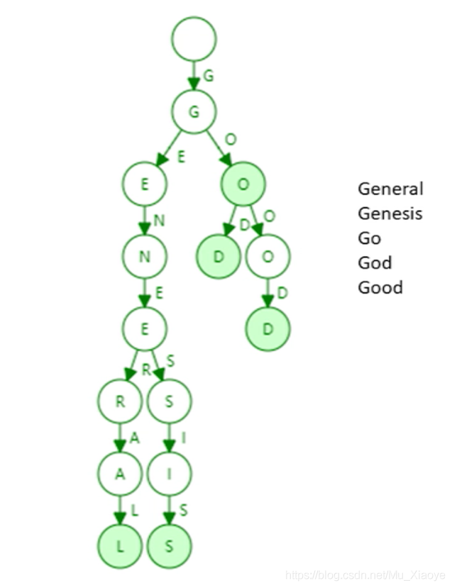
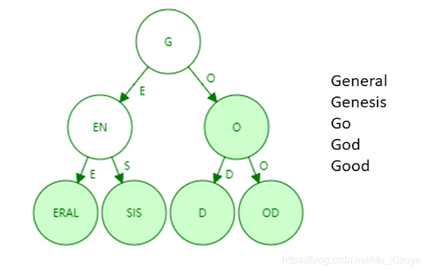
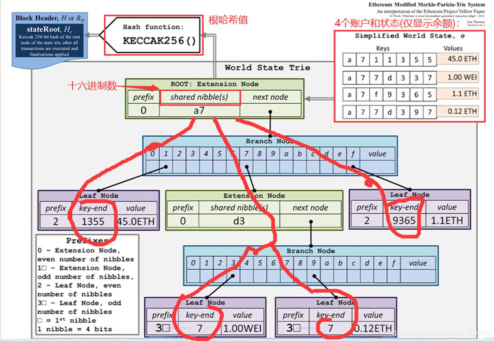
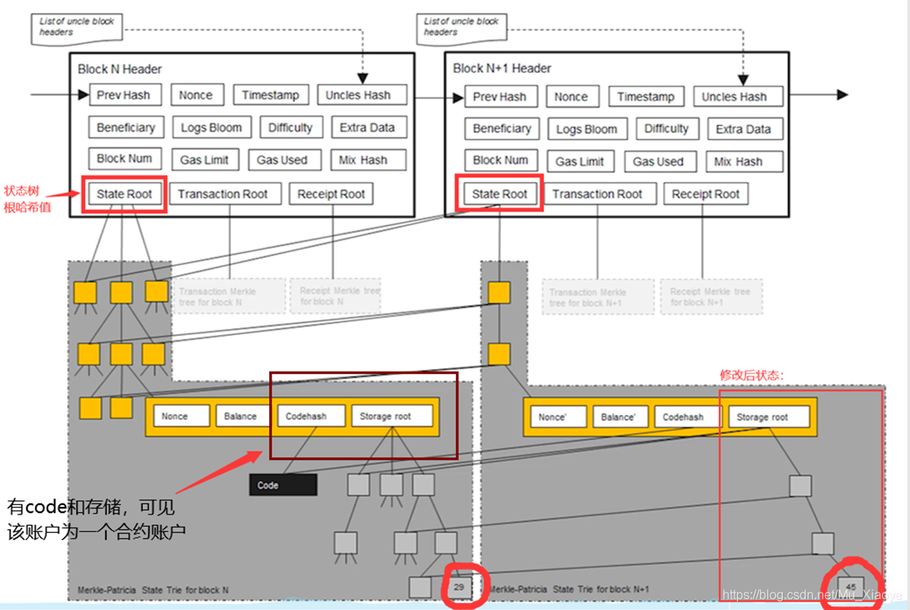
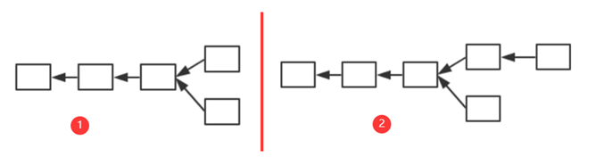
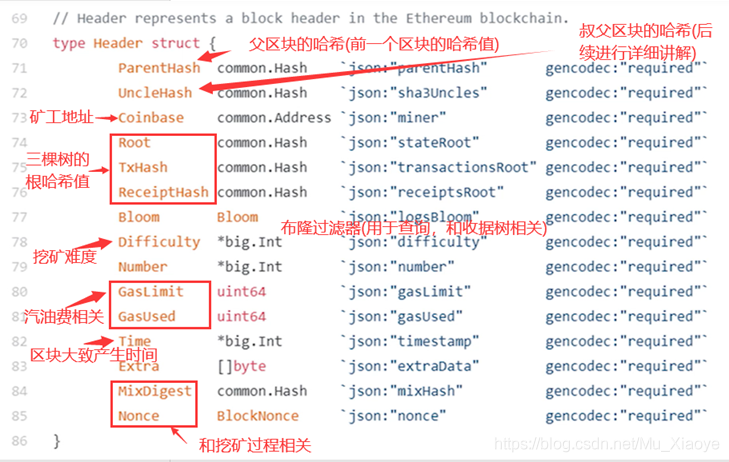
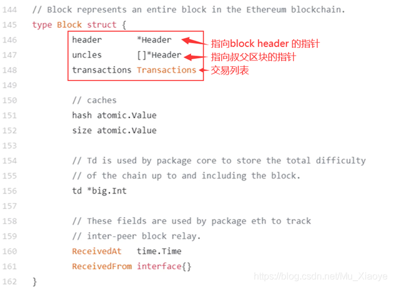
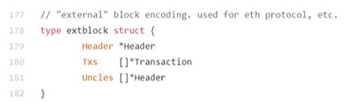

# 7.13	

## 肖臻教授第16节 ETH状态树

前一篇文章中有提过，以太坊采用基于账户的模式，系统中显式记录每个账户的余额。而以太坊这样一个大型分布式系统中，是采用的什么样的数据结构来实现对这些数据的管理的。

### **引入**

首先，我们要实现从账户地址到账户状态的映射。在以太坊中，账户地址为160字节，表示为40个16进制数额。状态包含了余额(balance)、交易次数(nonce),合约账户中还包含了code(代码)、存储(stroge)。

> **需要记住的是，在BTC和以太坊中，交易保存在区块内部，一个区块可以包含多个交易。通过区块构成区块链，而非交易。**

### **思考如何组织账户的数据结构**

1. 我们能否像BTC中，将哈希表的内容组织为Merkle Tree？
   但当新区块发布，哈希表内容会改变，再次将其组织为新的Merkle Tree?如果这样，每当产生新区块(ETH中新区块产生时间为10s左右)，都要重新组织Merkle Tree，很明显这是不现实的。
   需要注意的是，比特币系统中没有账户概念，交易由区块管理，而区块包含上限为4000个交易左右，所以Merkle Tree不是无限增大的。而ETH中，Merkle Tree来组织账户信息，很明显其会越来越庞大。
   实际中，发生变化的仅仅为很少一部分数据，我们每次重新构建Merkle Tree代价很大。

2. 那我们不要哈希表了，直接使用Merkle Tree，每次修改只需要修改其中一部分即可，这个可以吗？
   实际中，Merkle Tree并未提供一个高效的查找和更新的方案。此外，将所有账户构建为一个大的Merkle Tree，为了保证所有节点的一致性和查找速度，必须进行排序。

3. 那么经过排序，使用Sorted Merkle Tree可以吗？
   新增账户，由于其地址随机，插入Merkle Tree时候很大可能在Tree中间，发现其必须进行重构。所以Sorted Merkle Tree插入、删除(实际上可以不删除)的代价太大。

   > **注意：BTC系统中，虽然每个节点构建的Merkle Tree不一致（不排序），但最终是获得记账权的节点的Merkle Tree才是有效的。**

### **一个简单的数据结构——trie(字典树)**

1. trie中每个节点的分支数目取决于Key值中每个元素的取值范围(图例中最多26个英文字母分叉+一个结束标志位)。

2. trie查找效率取决于key的长度。实际应用中（以太坊地址长度为160byte）。
3. 理论上哈希会出现碰撞，而trie上面不会发生碰撞。
4. 给定输入，无论如何顺序插入，构造的trie都是一样的。
5. 更新操作局部性较好。
6. 那么trie有缺点吗？当然有：
   trie的存储浪费。很多节点只存储一个key，但其“儿子”只有一个，过于浪费。因此，为了解决这一问题，我们引入**Patricia tree/trie**。

### **Patricia trie(Patricia tree)**

Patricia trie就是进行了路径压缩的trie。如上图例子，进行路径压缩后如下图所示：

需要注意的是，如果新插入单词，原本压缩的路径可能需要扩展开来。那么，需要考虑什么情况下路径压缩效果较好？树中插入的键值分布较为稀疏的情况下，可见路径压缩效果较好。

在以太坊系统中，160位的地址存在2^160 种，该数实际上已经非常大了，和账户数目相比，可以认为地址这一键值非常稀疏。

所以，以太坊系统中可如此，将所有账户组织为一个经过路径压缩和排序的Merkle Tree，其根哈希值存储于block header中。

> **BTC系统中只有一个交易组成的Merkle Tree，而以太坊中有三个(三棵树)。**
> **也就是说，在以太坊的block header中，存在有三个根哈希值。**

**根哈希值的用处：**

1. 防止篡改。
2. 提供Merkle proof，可以证明账户余额，轻节点可以进行验证。
3. 证明某个发生了交易的账户是否存在。

###  **MPT(Modified Patricia tree)**

下图为以太坊中使用的MPT结构示意图。右上角表示四个账户(为直观，显示较少)和其状态(只显示账户余额)。（需要注意这里的指针都是哈希指针）

每次发布新区块，状态树中部分节点状态会改变。但改变并非在原地修改，而是新建一些分支，保留原本状态。如下图中，仅仅有新发生改变的节点才需要修改，其他未修改节点直接指向前一个区块中的对应节点。

所以，系统中全节点并非维护一棵MPT，而是每次发布新区块都要新建MPT。只不过大部分节点共享。

为什么要保存原本状态？为何不直接修改？

为了便于回滚。如下1中产生分叉，而后上面节点胜出，变为2中状态。那么，下面节点中状态的修改便需要进行回滚。因此，需要维护这些历史记录。

### **通过代码看以太坊中的数据结构**

1. block header 中的数据结构

 

2. 区块结构

   

3. 区块在网上真正发布时的信息

   

> **最后说明**
> 状态树中保存Key-value对，key就是地址，而value状态通过RLP(Recursive Length Prefix，一种进行序列化的方法)编码序列号之后再进行存储。

