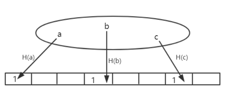
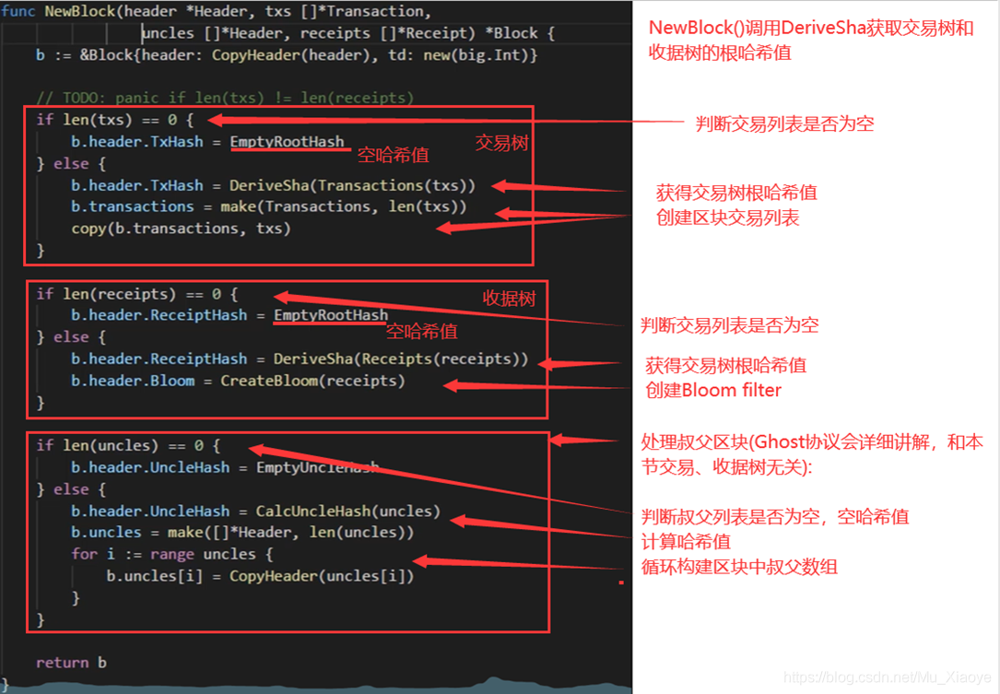
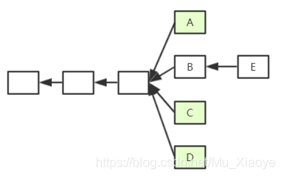
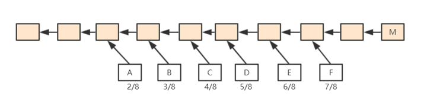
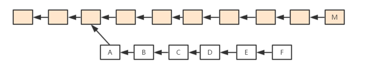

# 7.14	

## 肖臻教授第17节 ETH交易数和收据树

### **交易树和收据树**

每次发布一个区块时，区块中的交易会形成一颗Merkle Tree，即交易树。此外，以太坊还添加了一个收据树，每个交易执行完之后形成一个收据，记录交易相关信息。也就是说，交易树和收据树上的节点是一一对应的。

由于以太坊智能合约执行较为复杂，通过增加收据树，便于快速查询执行结果。交易树和收据树都是MPT，而BTC中都采用普通的MT(Merkle Tree)。

MPT的好处是支持查找操作，通过键值沿着树进行查找即可。对于状态树，查找键值为账户地址；对于交易树和收据树，查找键值为交易在发布的区块中的序号。

交易树和收据树只将当前区块中的交易组织起来，而状态树将所有账户的状态都包含进去，无论这些账户是否与当前区块中交易有关系。

多个区块状态树共享节点，而交易树和收据树依照区块独立。

交易树和收据树的用途：

1. 向轻节点提供Merkle Proof。
2. 更加复杂的查找操作(例如：查找过去十天的交易；过去十天的众筹事件等)。

### **Bloom filter(布隆过滤器)**

支持较为高效查找某个元素是否在某个集合中，最笨：元素遍历，复杂度为O(n)——轻节点不能用。

方法：给一个大的集合，计算出一个紧凑的“摘要”。

> **例：如下图，给定一个数据集，其中含义元素a、b、c，通过一个哈希函数H()对其进行计算，将其映射到一个其初始全为0的128位的向量的某个位置，将该位置置为1。将所有元素处理完，就可以得到一个向量，则称该向量为原集合的“摘要”。可见该“摘要”比原集合是要小很多的。**
> **假定想要查询一个元素d是否在集合中，假设H(d)映射到向量中的位置处为0，说明d一定不在集合中；假设H(d)映射到向量中的位置处为1，有可能集合中确实有d，也有可能因为哈希碰撞产生误报。**
>
> 

Bloom filter特点：有可能出现误报，但不会出现漏报。

Bloom filter变种：采用一组哈希函数进行向量映射，有效避免哈希碰撞。

#### 如果集合中删除元素该怎么操作？

无法操作。也就是说，简单的Bloom filter不支持删除操作。如果想要支持删除操作，需要将记录数不能为0和1，需要修改为一个计数器。

### **以太坊中Bloom filter的作用**

每个交易完成后会产生一个收据，收据包含一个Bloom filter记录交易类型、地址等信息。在区块block header中也包含一个Bloom filter，其为该区块中所有交易的Bloom filter的一个并集。

所以，查找时候先查找块头中的Bloom filter，如果块头中包含。再查看区块中包含的交易的Bloom filter，如果存在，再查看交易进行确认；如果不存在，则说明发生了“碰撞”。

好处是通过Bloom filter这样一个结构，快速大量过滤掉大量无关区块，从而提高了查找效率。

<u>我感觉作用就是更快的查找某一笔特定交易。</u>

### **补充**

以太坊的运行过程，可以视为**交易驱动的状态机**，通过执行当前区块中包含的交易，驱动系统从当前状态转移到下一状态。当然，BTC我们也可以视为**交易驱动的状态机**，其状态为UTXO。

对于给定的当前状态和给定一组交易，可以确定性的转移到下一状态(保证系统一致性)。

问题1：A转账到B，有没有可能收款账户不包含在状态树中？
可能。因为以太坊中账户可以节点自己产生，只有在产生交易时才会被系统知道。

问题2：可否将每个区块中状态树更改为只包含和区块中交易相关的账户状态？(大幅削减状态树大小，且和交易树、收据树保持一致)
不能。首先，这样设计要查找账户状态很不方便，因为不存在一个包含所有状态的状态树。其次，想一想如果有这样一个场景需要向一个新创建账户转账，因为需要知道收款账户的状态，才能给其添加金额，但由于其是新创建的账户，所有需要一直找到创世纪块才能知道该账户为新建账户，系统中并未存储，而区块链是不断延长的。

### **代码中具体数据结构**

 交易树和收据树的创建过程

## 肖臻教授第18节 ETH-GHOST（以太坊的共识机制）

BTC系统中出块时间为10min，而以太坊中出块时间被降低到15s左右，虽然有效提高了系统反应时间和吞吐率，却也导致系统临时性分叉变成常态，且分叉数目更多。这对于共识协议来说，就存在很大挑战。在BTC系统中，不在最长合法链上的节点最后都是作废的，但如果在以太坊系统中，如果这样处理，由于系统中经常性会出现分叉，则矿工挖到矿很大可能会被废弃，这会大大降低矿工挖矿积极性。而对于个人矿工来说，和大型矿池相比更是存在天然劣势。

对此，以太坊设计了新的公式协议——GHOST协议(该协议并非原创，而是对原本就有的Ghost协议进行了改进)。

### **GHOST协议**

如图，假定以太坊系统存在以下情况，A、B、C、D在四个分支上，最后，随着时间推移B所在链成为最长合法链，因此A、C、D区块都作废，但为了补偿这些区块所属矿工所作的工作，给这些区块一些“补偿”，并称其为"Uncle Block"（叔父区块）。

规定E区块在发布时可以将A、C、D叔父区块包含进来，A、C、D叔父区块可以得到出块奖励的7/8，而为了激励E包含叔父区块，规定E每包含一个叔父区块可以额外得到1/32的出块奖励。为了防止E大量包含叔父区块，规定一个区块只能最多包含两个叔父区块，因此E在A、C、D中最多只能包含两个区块作为自己的出块奖励。

> **假定一个矿工挖出了B，此时他沿着其所在链继续挖，而他知道A是和自己“叔叔辈”，则可以将A包含进区块挖矿，若挖矿过程中又听到C也是“叔叔辈”，则可以停止挖矿，将C包含进来重新组织成一个新区块重新挖矿，实际中，由于挖矿过程的==无记忆性==，这样并不会降低成功挖到矿的概率。**

我们将“叔父”这个概念进行扩展，但问题在于，“叔父”这一定义隔多少代才好呢？

如下图所示，M为该区块链上一个区块，F为其严格意义上的叔父，E为其严格意义上的“爷爷辈”。以太坊中规定，如果M包含F辈区块，则F获得7/8出块奖励；如果M包含E辈区块，则F获得6/8出块奖励，以此类推向前。直到包含A辈区块，A获得2/8出块奖励，再往前的“叔父区块”，对于M来说就不再认可其为M的"叔父"了。

对于M来说，无论包含哪个辈分的“叔父”，得到的出块奖励都是1/32出块奖励。

也就是说，叔父区块的定义是和当前区块在七代之内有共同祖先才可（合法的叔父只有6辈）。

这样，就方便了全节点进行记录，此外，也从协议上鼓励一旦出现分叉马上进行合并。

### **以太坊中的奖励**

BTC：静态奖励(出块奖励)+动态奖励(交易费，占据比例很小)

ETH：静态奖励(出块奖励+包含叔父区块的奖励)+动态奖励(汽油费，占据比例很小，叔父区块没有)

BTC中为了人为制造稀缺性，比特币每隔一段时间出块奖励会降低，最终当出块奖励趋于0后会主要依赖于交易费运作。而以太坊中并没有人为规定每隔一段时间降低出块奖励。

#### 以太坊中包含了叔父区块，要不要包含叔父区块中的交易？

不应该，叔父区块和同辈的主链上区块有可能包含有冲突的交易。而且我们前文也提到，叔父区块是没有动态奖励的。因此，一个节点在收到一个叔父区块的时候，只检查区块合法性而不检查其中交易的合法性。

当然，对于分叉后的堂哥区块怎么办？例如下图所示，A->F该链并非一个最长合法链，所以B->F这些区块怎么办？该给挖矿补偿吗？

如果规定将下面整条链作为一个整体，给予出块奖励，这一定程度上鼓励了分叉攻击(降低了分叉攻击的成本，因为即使攻击失败也有奖励获得)。因此，ETH系统中规定，只认可A区块为叔父区块，给予其补偿，而其后的区块全部作废。

## 