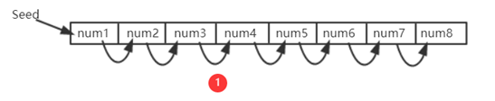
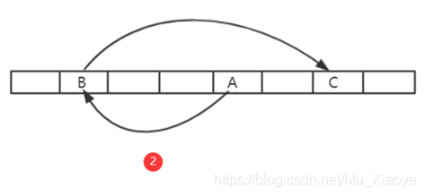
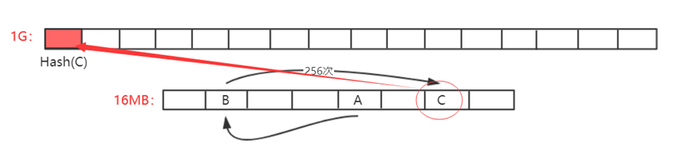
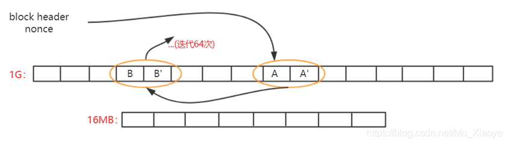

# 7.15

## 肖臻教授第19节 ETH-挖矿算法

在之前的BTC篇中，介绍了比特币系统中使用的挖矿算法。挖矿这一过程，虽然并没有创造什么实际价值，但挖矿本身维持了比特币系统的稳定。总体来说，比特币系统中的挖矿算法较为成功，并未发现大的漏洞。

当然，比特币系统的挖矿算法也存在一定问题，其中最为突出的就是导致了挖矿设备的专业化，普通计算机用户难以参与进去，导致了挖矿中心化的局面产生，而这与“去中心化”这一理念相违背。

因此，在比特币之后包括以太坊在内的许多加密货币针对该缺陷进行改进，希图做到ASIC Resistance(抗ASIC专用矿机)。由于ASIC芯片相对普通计算机来说，算力强但访问内存性能差距不大，因此常用的方法为Memory Hard Mining Puzzle，即增加对内存访问的需求。

### **LiteCoin(莱特币)**

莱特币曾一度成为市值仅次于比特币的第二大货币。其基本设计大体上和比特币一致，但针对挖矿算法进行了修改。

莱特币的puzzle基于Scrypt。Scrypt为一个对内存性能要求较高的哈希函数，之前多用于计算机安全密码学领域。

#### 莱特币挖矿算法基本思想

1. 设置一个很大的数组，按照顺序填充伪随机数。

> 因为哈希函数的输出我们并不能提前预料，所以看上去就像是一大堆随机的数据，因此称其为“伪随机数”。

Seed为种子节点，通过Seed进行一些运算获得第一个数，之后每个数字都是通过前一个位置的值取哈希得到的。

            2. 在需要求解Puzzle的时候，按照伪随机顺序，从数组中读取一些数，每次读取位置与前一个数相关。例如：第一次，从A位置读取其中数据，根据A中数据计算获得下一次读取位置B；第二次,从B位置读取其中数据，根据B中数据计算获得下一次读取位置C。

#### 分析

如果数组足够大，对于挖矿矿工来说，必须保存该数组以便查询，否则每次不仅计算位置，还要根据Seed计算整个数组数据，才能查询到对应位置的数据。这对于矿工来说，计算复杂度大幅度上升。

当然，矿工可以选择只保存一部分数据，例如：只保存奇数位置数据，偶数位置需要时再根据前一个奇数位置数据计算即可，从而对内存空间大小减少了一半(计算复杂度提高一点，但内存减少一半)。

> **核心思想：不能仅仅进行运算，增加其对内存的访问，从而实现对ASIC芯片不友好。**

这个IDEA有问题吗？看似蛮不错的，使得ASIC矿机挖矿变得不友好，但该方法对Puzzle验证并不是很友好。想要验证该Puzzle，也需要存储该数组，因此对于轻节点来说，并不友好(系统中绝大多数节点为轻节点)。

因此，莱特币真正应用来说，数组大小不敢设置太大。

例如：对于计算机而言，1G毫无压力，而对于手机APP来说，1G占据空间就过大了。所以，实际中，莱特币系统设计的数组大小仅仅128K大小。起初莱特币发行时，不仅希望能够抗拒ASIC，还希望能抗拒GPU。但实际中，后来慢慢出现了GPU挖矿，再后来，ASIC芯片挖矿也出现了。实际应用中，莱特币的设计并未起到预期作用，也就是说，128k对于ASIC Resistance来说过小了。

### **以太坊**

以太坊的理念与莱特币相同，都是Memory Hard Mining Puzzle，但具体设计上与莱特币不同。

#### 以太坊挖矿算法基本思想

以太坊中，设计了两个数据集，一大一小。小的为16MB的cache，大的数据集为1G的dataset(DAG)。其关系为，1G的数据集是通过16MB数据集生成而来的。

> **思考为何要设计一大一小两个数据集？**
> **为了便于进行验证，轻节点保存16MB的Cache进行验证即可，而矿工为了挖矿更快，减少重复计算则需要存储1GB大小的大数据集。**

16MB的小Cache数据生成方式与莱特币中生成方式较为类似。

1. 通过Seed进行一些运算获得第一个数，之后每个数字都是通过前一个位置的值取哈希获得的。
2. 不同：      莱特币：直接从数组中按照伪随机顺序读取一些数据进行运算； 以太坊：先生成一个更大的数组(注：以太坊中这两个数组大小并不固定，因为考虑到计算机内存不断增大，因此该两个数组需要定期增大)
3. 大的DAG生成方式：
   大的数组中每个元素都是从小数组中按照伪随机顺序读取一些元素，方法同莱特币中相同。如第一次读取A位置数据，对当前哈希值更新迭代算出下一次读取位置B，再进行哈希值更新迭代计算出C位置元素。如此来回迭代读取256次，最终算出一个数作为DAG中第一个元素，如此类推，DAG中每个元素生成方式都依次类推。

#### 分析

轻节点只保存小的cache，验证时进行计算即可。但对于挖矿来说，如果这样则大部分算力都花费在了通过Cache计算DAG上面，因此，其必须保存大的数组DAG以便于更快挖矿。

> **以太坊挖矿过程：**
>
> **根据区块block header和其中的Nonce值计算一个初始哈希，根据其映射到某个初始位置A，读取A位置的数及其相邻的后一个位置A’上的数,根据该两个数进行运算，算得下一个位置B，读取B和B’位置上的数，依次类推，迭代读取64次，共读取128个数。**
>
> **最后，计算出一个哈希值与挖矿难度目标阈值比较，若不符合就重新更换Nonce，重复以上操作直到最终计算哈希值符合难度要求或当前区块已经被挖出。**
>
> 

### **权益证明(POS: Proof of State)**

权益证明：按照所占权益投票进行共识达成，类似于股份制有限共识按照股份多少投票，权益证明不需要挖矿。

但实际上，以太坊目前仍然是POW挖矿共识机制。在设计之初，以太坊开发者就设想要从POW转向POS，并为了防止有矿工不愿意转埋下了一颗“难度炸弹”。但截至目前，以太坊仍然基于POW共识机制。

### **其他观点**

本篇中挖矿算法设计一直趋向于让大众参与，这一才是公平的。且由于参与人员的分散，算力分散，也进一步使得系统更安全。

但同样一件事物，从不同观点看就有不同的看法。也有人认为让普通计算机参与挖矿是不安全的，像比特币那样，让中心化矿池参与挖矿才是安全的。为什么呢？

因为要攻击系统，需要购入大量只能进行特定货币挖矿的矿机通过算力进行强行51%攻击，而攻击成功后，必然导致该币种的价值跳水，攻击者投入的硬件成本将会全部打水漂。而如果让通用计算机也参与挖矿，发动攻击成本便大幅度降低，目前的大型互联网公司，将其服务器聚集起来进行攻击即可，而攻击完成后这些服务器仍然可以转而运行日常业务。因此，也有人认为，在挖矿上面，ASIC矿机“一统天下”才是最安全的方式。
