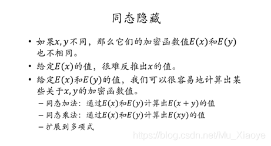

# 7.6

## 肖臻教授第12节 BTC匿名性

一般来说,匿名性多与隐私保护相关。但实际上，比特币中的匿名并非真正的匿名，而是假的匿名。实际上，比特币与纸币相比，纸币的匿名性更好，因为其并没有对个人信息的标记。也正是因为其匿名性，很多非法交易采用现金交易。但现金存在保管、运输等各个方面的不便。

实际上，比特币中的数据是完全公开的，而网上的交易是要与实体世界进行交易的，所以大大破坏了其匿名性。假如银行允许用假名(以前的存折时代)，由于银行数据并非公开，所以银行系统的匿名性是要比比特币更好的。

### **BTC系统中什么情况会破坏其匿名性？**

1. 用户可以生成多个地址账户，但这些地址账户可以被关联起。

   表面上看，每次交易可以更换公私钥对，从而每次都是新的账户，具有很强的匿名性。但实际上，这些账户在一定情况下，是可以被关联起来的。

2. 地址账户与个人在真实社会中的身份也可能会产生关联。

   **任何使得BTC和实体世界中关联的操作都有可能泄露用户真实身份**，其中最明显的就是资金的转入转出。要得到BTC，如果用钱买，就会与实体世界进行交互。想要将BTC转为现实中的货币，也同样需要与实体世界交互。

### **BTC匿名性有多好？**

匿名的本质是不想要暴露身份。而对于普通人来说，BTC的现有机制已经足够保持个人隐私了。但如果涉及违法，行政机关想要获得真实身份，其实很容易。

### **那么可以采取哪些方法尽可能提高匿名性？**

从应用层看，可以将各个不同用户的BTC混合在一起，使得追查变得混乱(Coin mixing)；从网络层看，可以采用多路径转发的方法，数据不直接发送出去，而是经过很多跳(洋葱路由的基本思想)。

### **零知识证明**

**零知识证明：一方（证明者）向另一方（验证者）证明某一个陈述是正确的，但不需要透露除该陈述是正确的之外的任何信息。**

### **同态隐藏**

零知识证明的数学基础便是同态隐藏。上图为同态隐藏的三个性质。
第一个性质，说明如果有E(X)=E(y)，则必然有x=y。(无碰撞)
第二个性质，说明加密函数不可逆。知道加密值，无法反推出密码值。
第三个性质，最为重要，称为同态运算。说明对加密后的函数值进行某些代数运算，等价于对输入直接进行代数运算再加密。

